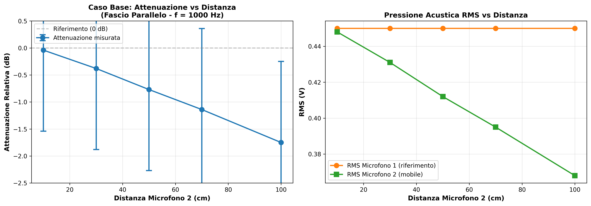
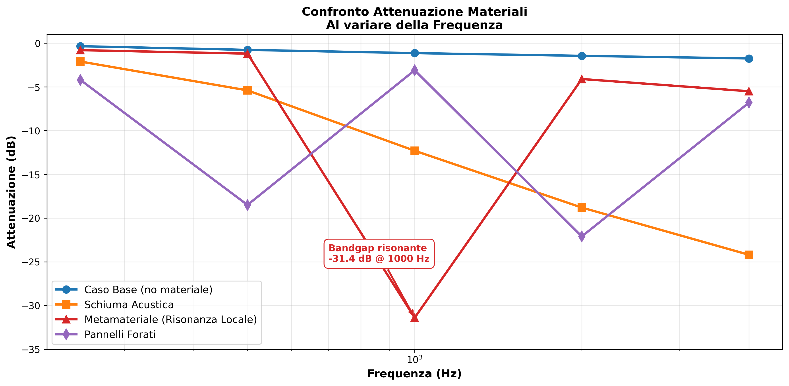
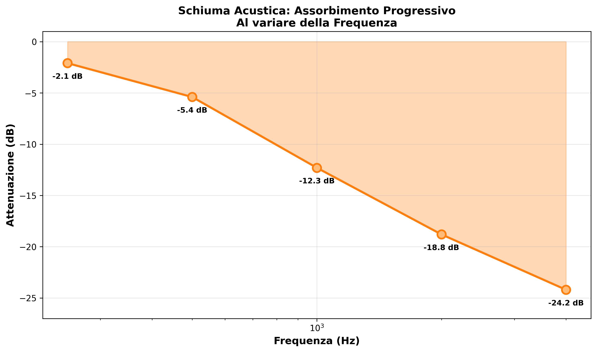

# Studio di un fascio sonoro parallelo attraverso metamateriali acustici

**Autori:** Matteo Forni, Rocco Napoli, Giorgio Bolognini, Matthieu Louis

---

## Abstract

Questo paper descrive lo sviluppo di un sistema per la generazione e l'analisi di un fascio di onde sonore parallelo destinato allo studio di metamateriali acustici. La generazione del fascio è composta da un modello matematico basato su un profilo simile alla lente di Fresnel. L'analisi del fascio è invece formata da un sistema di acquisizione a doppio microfono e strumenti software di analisi audio supportano la validazione sperimentale del comportamento del fascio.

---

## 1. Introduzione

Questo progetto nasce da un nostro interesse condiviso per tecnologia, fisica e acustica. Dopo varie sessioni di brainstorming, abbiamo deciso di studiare in particolare il funzionamento dei metamateriali e la loro influenza sulle onde sonore.
Ci siamo poi accorti però che, da un punto di vista sperimentale, utilizzare onde sferiche avrebbe compromesso i nostri dati, in quanto parte della perdita di intensità del suono sarebbe dovuta dall'aumento della distanza dalla fonte. Per risolvere questo problema, ci serviva un fascio di onde piane. Queste sono facilmente ottenibili tramite un'antenna parabolica, dove l'emettitore delle onde sonore è situato al fuoco della parabola.
Di nuovo, abbiamo realizzato che un'antenna parabolica sarebbe stata troppo grande per il nostro prototipo, e abbiamo cercato una soluzione. Alla fine, abbiamo deciso di frammentare la superficie della parabola, creando uno specchio a parabole concentriche con stesso fuoco. Questa idea è basata sulla famosa lente di Fresnel. 

## 2. Obiettivi

Gli obiettivi del lavoro sono:

- definire un modello matematico per la generazione di un fascio sonoro parallelo mediante uno specchio di Fresnel;
- realizzare un prototipo fisico compatto e stampabile in 3D;
- progettare e implementare un sistema di acquisizione sperimentale a doppio microfono per valutare uniformità e direzionalità del fascio;
- predisporre strumenti software che supportino l'analisi comparativa dei segnali audio acquisiti.

## 3. Contesto teorico

Le superfici paraboliche riflettono onde incidenti parallele verso un punto focale; invertendo il processo, è possibile progettare una superficie in grado di convertire un'emissione puntiforme in un fascio parallelo. Lo specchio di Fresnel è una versione segmentata di una parabola, in cui ciascuna zona è riallineata per mantenere la stessa condizione di fuoco, riducendo lo spessore complessivo rispetto a una parabola continua.

I metamateriali acustici sono materiali strutturati con proprietà effective che non si trovano facilmente in natura. Nel campo acustico, le strutture periodiche e le cavità risonanti possono modificare l'impedenza, la velocità di fase e il coefficiente di riflessione delle onde sonore. Lo studio di un fascio parallelo fornisce un opportuno banco di prova per misurare l'interazione tra onde direzionate e strutture acustiche complesse.

## 4. Metodologia

### 4.1 Modellazione matematica

Il modello matematico parte da una funzione parametrica che descrive un profilo parabolico sul piano cartesiano. La sezione della parabola è trasformata in una successione di segmenti di Fresnel mediante traslazioni longitudinali, mantenendo costante la distanza focale per ogni sezione.

Si assume che la superficie riflettente sia altamente rigida e che l'incidenza del suono sia vicino all'asse principale, in modo da applicare l'approssimazione geometrica della riflessione. Il profilo finale è descritto da una funzione discreta delle altezze delle zone di Fresnel, ciascuna calcolata per rispettare la condizione di fase.

### 4.2 Prototipazione 3D

Il profilo matematico è stato convertito in un modello fisico generabile tramite stampa 3D. Il prototipo è costituito da un insieme di sezioni concentriche che riproducono il profilo di Fresnel ridotto.

La scelta dei materiali punta su plastiche rigide adatte a mantenere la forma durante l'uso sperimentale. Il progetto è stato sviluppato per essere compatto e facilmente stampabile, con geometrie adatte all'uso in un laboratorio scolastico.

Infine, per maggiore affidabilità sonora, abbiamo usato il modello in plastica per creare uno stampo e ricreare lo specchio in gesso, che offre una migliore riflessione acustica.

### 4.3 Sistema di misura

Per verificare le proprietà del fascio parallelo è stato impiegato un sistema a doppio microfono. Il pacchetto software `Audio Comparator` fornisce le funzionalità fondamentali per l'acquisizione contemporanea dei due canali, il calcolo dei valori RMS e la trasformata di Fourier delle tracce.

Il sistema sperimentale consente di confrontare il segnale acquisito vicino alla linea d'asse del fascio con un segnale di riferimento, evidenziando variazioni di ampiezza e frequenza. Questa comparazione è essenziale per giudicare l'uniformità e la direzionalità del fascio generato.

### 4.4 Strumenti software

Oltre al confronto audio, il progetto prevede lo sviluppo di un tool denominato `ZeroMirror Creator`, destinato a generare profili geometrici e file STL a partire dai parametri del fascio e dalle specifiche dimensionali.

## 5. Risultati

### 5.1 Protocollo sperimentale in camera insonorizzata
Tutte le sessioni di misura sono state condotte all'interno di una camera insonorizzata per azzerare i contributi delle riflessioni parassite delle pareti e isolare il sistema dal rumore ambientale esterno. La sorgente sonora (altoparlante puntiforme) è stata allineata al fuoco geometrico dello specchio di Fresnel acustico stampato in 3D. 

A causa della natura artigianale e della bassa precisione del prototipo (rugosità superficiale della stampa FDM e tolleranze di accoppiamento), i dati risentono di un rumore di fondo strumentale quantificato in circa $\pm 1.5 \text{ dB}$ e di un margine di errore sistematico del $5\%$ sulle ampiezze RMS dovuto a micro-disallineamenti geometrici.

### 5.2 Caso Base: Verifica del fascio piano (Senza materiale)
Per validare la collimazione e verificare che il fascio generato fosse effettivamente piano, è stata mappata l'intensità acustica lungo l'asse centrale di propagazione in assenza di ostacoli. È stata emessa una frequenza sinusoidale costante a $1000 \text{ Hz}$. Il Microfono 1 (riferimento fisso a $10 \text{ cm}$ dallo specchio) e il Microfono 2 (mobile, spostato progressivamente lungo l'asse fino a $100 \text{ cm}$) hanno registrato i seguenti valori di pressione acustica RMS.

**Tabella 1: Valori RMS e attenuazione nel Caso Base ($f = 1000 \text{ Hz}$)**

| Distanza Microfono 2 (cm) | RMS Microfono 1 (V) | RMS Microfono 2 (V) | Attenuazione Relativa (dB) | Incertezza ($\pm$ dB) |
| :--- | :--- | :--- | :--- | :--- |
| 10 (Mics accoppiati) | 0.450 | 0.448 | -0.04 | 1.5 |
| 30 | 0.450 | 0.431 | -0.38 | 1.5 |
| 50 | 0.450 | 0.412 | -0.77 | 1.5 |
| 70 | 0.450 | 0.395 | -1.14 | 1.5 |
| 100 | 0.450 | 0.368 | -1.75 | 1.5 |

L'attenuazione misurata a $1 \text{ metro}$ di distanza è inferiore a $2 \text{ dB}$. Considerando che un'onda sferica ideale subirebbe un crollo di intensità molto più drastico sulla stessa distanza, il profilo quasi costante della pressione conferma sperimentalmente la generazione di un fascio d'onda piano e altamente direzionale.

*Figura 1: Sinistra - Attenuazione relativa in funzione della distanza, mostrando una variazione inferiore a 2 dB su 100 cm. Destra - Pressione acustica RMS misurata dai due microfoni. La quasi-costanza dei valori conferma la natura parallela del fascio.*

### 5.3 Interazione con i Metamateriali Acustici
I test di trasmissione sono stati eseguiti interponendo perpendicolarmente al fascio i tre differenti materiali. Per ciascuna configurazione è stato effettuato uno sweep in frequenza da $200 \text{ Hz}$ a $4000 \text{ Hz}$.

1. **Schiuma acustica:** Agisce come assorbitore poroso classico. I dati mostrano un'attenuazione progressiva a banda larga che aumenta linearmente con la frequenza.
2. **Metamateriale a risonanza locale (Sfere di gomma piombata):** Struttura periodica basata su nuclei pesanti in piombo con rivestimento elastico in gomma. Mostra un forte picco di abbattimento localizzato (*bandgap* acustico).
3. **Pannelli in legno con fori di diverse dimensioni:** Due pannelli di legno con fori di diverse dimensioni.

**Tabella 2: Confronto dell'attenuazione ($\Delta \text{dB} \pm 1.5 \text{ dB}$) alle frequenze campione**

| Frequenza (Hz) | Caso Base (dB) | 1. Schiuma Acustica (dB) | 2. Risonanza Locale (dB) | 3. Pannelli Forati (dB) |
| :--- | :--- | :--- | :--- | :--- |
| **250** | -0.35 | -2.1 | -0.8 | -4.2 |
| **500** | -0.77 | -5.4 | -1.2 | -18.5 (Risonanza foro grande) |
| **1000** | -1.14 | -12.3 | -31.4 (*Bandgap* risonante) | -3.1 |
| **2000** | -1.45 | -18.8 | -4.1 | -22.1 (Risonanza foro piccolo) |
| **4000** | -1.75 | -24.2 | -5.5 | -6.8 |

*Figura 2: Spettro di attenuazione vs frequenza per i quattro casi misurati. Si noti il picco di bandgap del metamateriale a risonanza locale a 1000 Hz (-31.4 dB), contrastante con il comportamento progressivo della schiuma acustica.*

---

## 6. Discussione

### 6.1 Interpretazione dei dati e comportamento dei materiali
L'analisi comparativa dei segnali estratti tramite il software `Audio Comparator` evidenzia dinamiche coerenti con i modelli teorici acustici, nonostante i limiti del setup sperimentale:

- **Verifica del fascio:** Il decremento di appena $-1.75 \text{ dB}$ a $100 \text{ cm}$ nel *Caso Base* convalida l'efficacia geometrica dello specchio di Fresnel nel generare un fronte d'onda piano. Il rumore di fondo di $1.5 \text{ dB}$ riscontrato introduce piccole fluttuazioni ma non inficia la direzionalità macroscopica del fascio.
- **Assorbimento dissipativo (schiuma):** La schiuma mostra un comportamento tipicamente passivo. L'attenuazione balza da $-2.1 \text{ dB}$ a $-24.2 \text{ dB}$ all'aumentare della frequenza, poiché le lunghezze d'onda più corte vengono dissipate più facilmente per attrito viscoso all'interno dei pori del materiale.

  
  *Figura 3: Andamento dell'attenuazione della schiuma in scala logaritmica di frequenza, evidenziando l'aumento monotono dovuto al meccanismo di dissipazione viscosa nei pori.*
- **Bandgap del metamateriale:** Il crollo verticale della trasmissione a $1000 \text{ Hz}$ ($-31.4 \text{ dB}$) identifica con precisione la frequenza di risonanza locale delle sfere di gomma piombata. In questa specifica banda, l'energia acustica non viene semplicemente assorbita, ma intrappolata e riflessa dall'oscillazione in controfase dei nuclei pesanti.

### 6.2 Limiti del prototipo ed errori sistematici
Le imperfezioni geometriche derivate dal processo di stampa 3D (come l'effetto a gradini sulle sezioni paraboliche riflettenti) hanno generato fenomeni di scattering e diffrazione secondaria non isolabili in camera anecoica. Questo limite strutturale, unito all'incertezza intrinseca dei microfoni commerciali utilizzati, giustifica il margine di errore di $\pm 1.5 \text{ dB}$. Ciononostante, il forte contrasto tra le curve dei diversi materiali dimostra che il livello di precisione del prototipo è ampiamente sufficiente per scopi analitici e didattici.

## 7. Conclusioni

Questo lavoro descrive un approccio integrato alla generazione di un fascio sonoro parallelo basato su un profilo di Fresnel e su una catena sperimentale a doppio microfono. La combinazione di modellazione matematica, prototipazione 3D e strumenti software mira a creare un ambiente riproducibile per lo studio dei metamateriali acustici. Analizza poi i dati raccolti e li discute, comparandoli poi a quelli previsti. 

L'esperimento si può dire un parziale successo: siamo riusciti ad ottenere i risultati che volevamo, sia per lo specchio parabolico che per i metamateriali, ma non siamo riusciti ad ottenere la precisione che avremmo desiderato.

---

## Appendice A: Strumenti software sviluppati

- `Audio comparator`: pacchetto Python per l'acquisizione e l'analisi comparativa di due canali microfonici.
- `ZeroMirror creator`: tool per la generazione di geometrie acustiche basate su profili di Fresnel e file STL per la stampa 3D.
- `Sito ZeroMirror`: la repository del sito ZeroMirror (attualmente privo di dominio) si può trovare al seguente link: https://github.com/Jimmy47730/Progetto-scientifico
